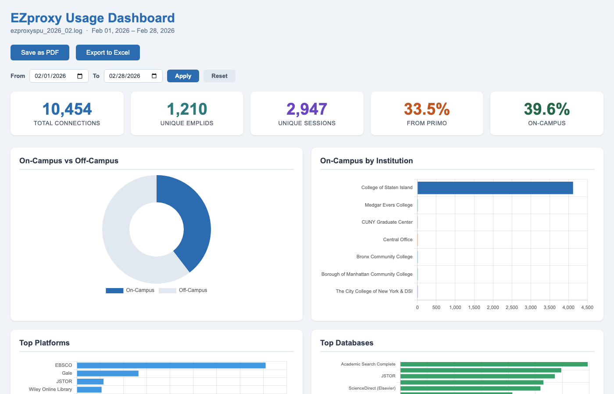
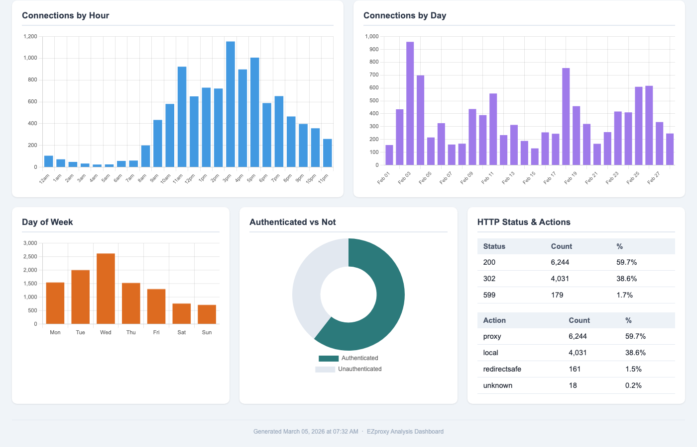

# EZproxy Dashboard

Analyze EZproxy [Starting Point URL](https://help.oclc.org/Library_Management/EZproxy/EZproxy_configuration/Starting_point_URLs_and_config_txt) (SPU) log files and generate a visual HTML dashboard with charts and statistics.

This project reads tab-separated EZproxy SPU logs, classifies connections by institution using IP address ranges, identifies databases and platforms from URLs, and produces either a terminal report or an interactive HTML dashboard with Chart.js.

## Scripts

### `dashboard.py` — Visual HTML dashboard

Generates a self-contained HTML file with interactive charts:

- Summary cards (total connections, unique users, sessions, Primo referral rate)
- Date range filter to narrow the dashboard to a specific period
- On-campus vs off-campus pie chart
- Institution breakdown bar chart
- Top platforms and top databases (two side-by-side charts)
- Top referring domains bar chart
- Connections by hour, day, and day of week
- Authenticated vs unauthenticated donut chart
- HTTP status code and action type tables
- Export to Excel (7 sheets) and Save as PDF

```
python3 dashboard.py data/institutions.csv path/to/logfile.log output.html
```

Open `output.html` in any browser to view the dashboard.





### `analyze_log.py` — Terminal text report

Prints detailed statistics to the terminal for quick analysis:

```
python3 analyze_log.py data/institutions.csv path/to/logfile.log
```

### `ezp-analysis.py` — Batch CSV export

Processes a directory of log files and outputs a CSV with per-institution connection counts:

```
python3 ezp-analysis.py data/institutions.csv path/to/logs/ output.csv
```

### `list_resources.py` — Mapping audit utility

Lists all platforms and databases found in a log file, showing which have friendly name mappings and which are unmapped:

```
python3 list_resources.py data/institutions.csv path/to/logfile.log
```

Use this to find codes that need to be added to `data/database_names.json`.

## Setup

### 1. Provide your institution IP ranges

Create a file at `data/institutions.csv` with two columns: `Institution` and `IP Addresses`. See `data/institutions_sample.csv` for the expected format.

IP addresses can be:
- Single IPs: `10.1.1.100`
- Ranges: `10.1.1.1 - 10.1.1.254`
- Multiple entries separated by newlines within a cell
- Parenthetical notes are ignored: `10.1.1.1 (Library server)`

### 2. Run a script

Most scripts use only the Python 3 standard library. `dashboard.py` also requires `openpyxl` for the Excel export (`pip install openpyxl`).

```
python3 dashboard.py data/institutions.csv your_log.log dashboard.html
```

## Database Name Mapping

The file `data/database_names.json` maps vendor-specific codes found in URLs to human-readable database names. It has three sections:

- **`ebsco`** (531 codes) — Maps EBSCO `db=` URL parameter codes to names (e.g., `a9h` = "Academic Search Complete"). Source: [EBSCOhost Database Short Names List](https://connect.ebsco.com/s/article/EBSCOhost-Database-Short-Names-List)
- **`gale`** (91 codes) — Maps Gale `p=` URL parameter codes to names (e.g., `AONE` = "Gale OneFile: Academic OneFile"). Legacy codes from [Gale product codes per EBSCO](https://connect.ebsco.com/s/article/What-are-the-database-codes-for-Gale-products), plus current Gale product codes.
- **`domains`** (64 mappings) — Maps domains to friendly names for vendors that don't use database codes in their URLs (e.g., `jstor.org` = "JSTOR"). Hand-curated from URLs observed in logs.

Entries marked `UNKNOWN` were found in logs but haven't been identified yet. You can update the JSON file at any time to add or correct mappings.

## Log Format

This tool expects **tab-separated SPU log files** in the following format:

```
[timestamp]	IP	username	session_token	action	referrer	URL	status
```

For example:

```
[01/Feb/2026:08:15:32 -0500]	10.1.1.100	jsmith	abc123	Login	-	https://example.com	200
```

## Credits

This project was inspired by [ezproxy-analysis](https://github.com/robincamille/ezproxy-analysis) by Robin Camille Davis. The original script provided the concept of analyzing EZproxy SPU logs with Python to classify connections by institution IP ranges. This project rewrites and extends that idea with a visual dashboard, database-level resource identification, and a comprehensive code-to-name mapping system.
